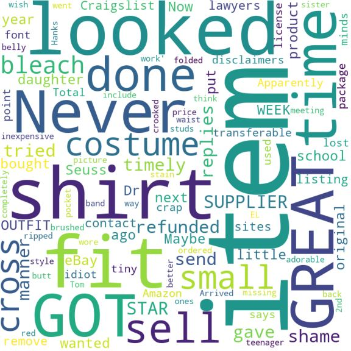

# Wish Upon a Star

  

    
  

  

    

      
    

  

  </a>

<!-- TOC -->

### TOC
- [Overview](#overview)
- [How to Use](#how-to-use)
- [Other Repo Files](#other-repo-files)
- [About Us](#about-us)

<!-- /TOC -->
## Overview
This repository hosts the code for the final project for the Text Mining and Search course. The task we aim to solve is a binary classification of Amazon product reviews from the _Clothing, Shoes and Jewellery_ category into positive and negative using the text of the review as the input data.

## How to Use
In order to explore our work, please refer to the `Main Notebook.ipynb` file. This notebook hold all the code, NLP processing and classification models used presented in a complete way.

This notebook is set up for execution on Google Colab. You may need or wish to modify a couple or lines of code:
1. In the first line of code, the dataset is downloaded. If you already have it in another location, you can avoid running the cell. Be sure to correctly specify the file path (3rd cell).
2. The results are by default saved in a Google Drive folder. You will need to change the results folder path in order to match you own Drive structure. Please note that the `Results` folder must exists before the notebook runs.

## Other Repo Files
The `Experiments` directory holds the code that was used to decide which NLP pipeline and which classifiers to use. It was structured for reusability and modularity. The code in this folder was then refactored and included in the `Main Notebook.ipynb` with the goal of making the notebook as understandable and self-contained as possible.

The two `utils` and `nlp` modules act as libraries for the other main files.

## Data
The data can be found at <a href="http://snap.stanford.edu/data/amazon/productGraph/categoryFiles/reviews_Clothing_Shoes_and_Jewelry_5.json.gz">this</a> link.

## About Us
**Davide Toniolo**
- _Current Studies_: Student at the Master Degree in Data Science, University of Milano Bicocca
- _Background_: Bachelor Degree in Physics, University of Milano Bicocca

  
  

**Lorenzo Camaione**
- _Current Studies_: Student at the Master Degree in Data Science, University of Milano Bicocca
- _Background_: Bachelor Degree in Computer Science, University of L'Aquila

  
  

